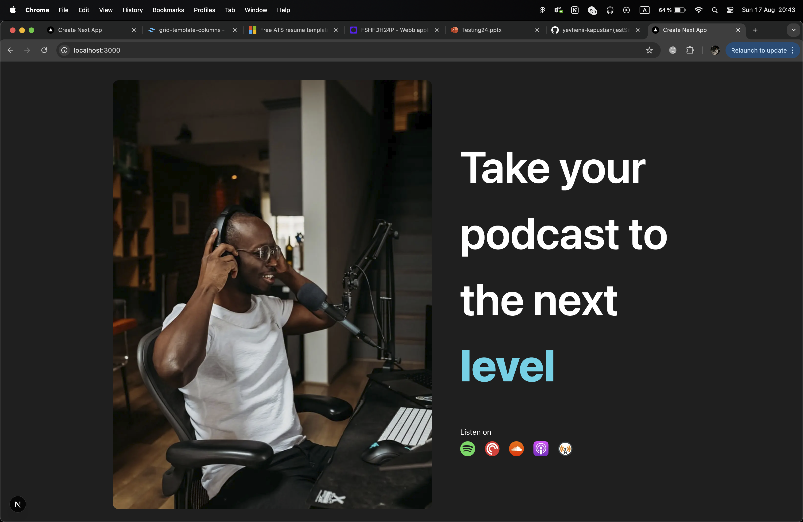
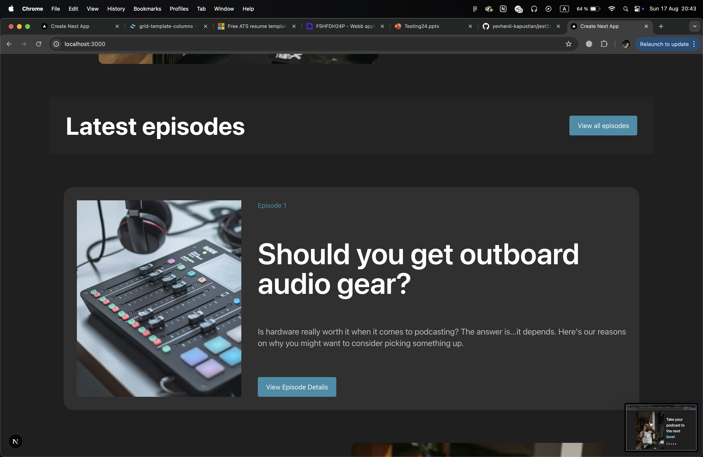
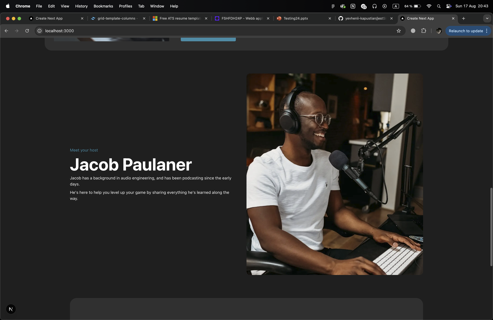
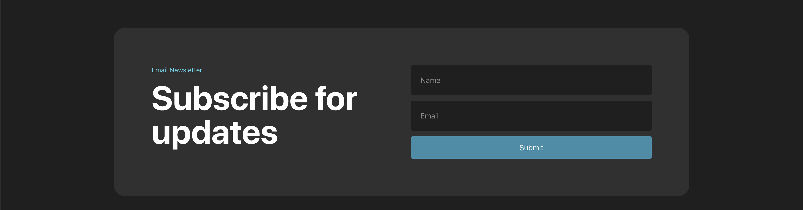
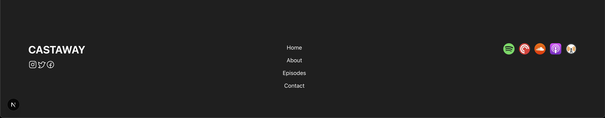

Podcast SPA

    OVERVIEW: 
        This project is a Single Page Application (SPA) built with React (Next.js).
        The site is centered around a podcast between two hosts, where users can explore the latest episodes, learn more about the hosts, and subscribe to a newsletter.

    FEATURES & FUNCTIONALITY:
        Header:
            Contains site logo and navigation links.
            Navigation should work between sections/pages. (In my example no)

        Welcome Component
            Displays the main site title.  
            Contains an image of one of the hosts.  
            Provides direct links to music platforms where the podcast can be listened to.

        Latest Episodes:
            Displays onClick a list of recent podcast episodes.
            Each episode should have a title, description, and "Read More" button.

        Host Introduction:
            A section introducing the podcast host with his bio & photo.

        Newsletter Input:
            Input field where a user can enter their name & email.
            On submit, the email should be added to a subscription list (mocked).

        Footer:
            Contains site logo and navigation links.
            Displays social media links (Instagram, Twitter, Facebook).
            Displays links to listen on music platforms (e.g., Spotify, Apple Podcasts).
